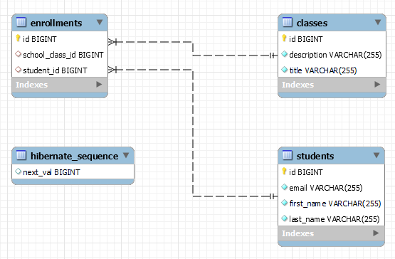

# Esercizio - Spring Boot - Hibernate
* scrivere un'applicazione Spring Boot che utilizzi le seguenti dipendenze:
  * `Lombok`
  * `Spring Boot DevTools`
  * `Web primaverile`
  * `Dati primaverili JPA`
  * `Driver MySQL`
* usa `hibernate` e `JPA` per connetterti a un database mysql locale (ad esempio `devdb`)
* il parametro `ddl-auto` deve essere configurato in modo che `hibernate` crei e poi distrugga lo schema alla fine della sessione
* considera il seguente caso d'uso:
  * `1 studente ---> n iscrizioni`
  * `1 classe ---> n iscrizioni`
* usando le giuste annotazioni e considerando, scrivi il codice che creerà:
  * la tabella `studenti` dove ogni studente ha:
    * una chiave primaria
    * una colonna `cognome` (non nullo)
    * una colonna `firstName` (non null)
    * una colonna `email` univoca e non nulla
  * la tabella `classi` dove ogni classe ha:
    * una chiave primaria
    * un `titolo` (non nullo)
    * una `descrizione` (non nulla)
  * la tabella di join `iscrizioni` con:
    * una chiave primaria
    * le 2 chiavi esterne
* quindi la struttura finale dovrebbe essere come la seguente immagine:
   

# Exercise - Spring Boot - Hibernate
* write a Spring Boot application that uses the following dependencies:
  * `Lombok`
  * `Spring Boot DevTools`
  * `Spring Web`
  * `Spring Data JPA` 
  * `MySQL Driver`
* use `hibernate` and `JPA` to connect to a local mysql database (e.g. `devdb`)
* the `ddl-auto` parameter has to be configured in a way that `hibernate` will create and then destroy the schema at the end of the session
* consider the following use case:
  * `1 student ---> n enrollments`
  * `1 class ---> n enrollments`
* using the right annotations and considering, write the code that will create:
  * the table `students` where each student has:
    * a primary key
    * a column `lastName` (not null)
    * a column `firstName` (not null)
    * a column `email` that is unique and not null
  * the table `classes` where each class has:
    * a primary key
    * a `title` (not null)
    * a `description` (not null)
  * the join table `enrollments` with:
    * a primary key
    * the 2 foreign keys

